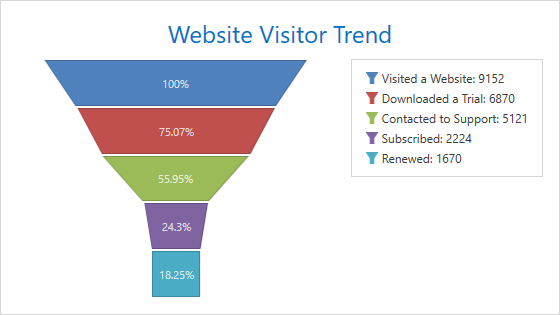

<!-- default badges list -->

<!-- default badges end -->
<!-- default file list -->
*Files to look at*:

* [MainWindow.xaml](./CS/FunnelChart/MainWindow.xaml) (VB: [MainWindow.xaml](./VB/FunnelChart/MainWindow.xaml))
* [MainWindow.xaml.cs](./CS/FunnelChart/MainWindow.xaml.cs) (VB: [MainWindow.xaml.vb](./VB/FunnelChart/MainWindow.xaml.vb))

<!-- default file list end -->

# How to create a 2D Funnel chart

This example demonstrates how to create a 2D [Funnel](https://docs.devexpress.com/WPF/17091/controls-and-libraries/charts-suite/chart-control/fundamentals/series-fundamentals/2d-series-types/funnel-series) chart.

1. Create a [ChartControl](https://docs.devexpress.com/WPF/DevExpress.Xpf.Charts.ChartControl) and set its [ChartControl.Diagram](https://docs.devexpress.com/WPF/DevExpress.Xpf.Charts.ChartControl.Diagram) property to a [SimpleDiagram2D](https://docs.devexpress.com/WPF/DevExpress.Xpf.Charts.SimpleDiagram2D) object.

    > Note that the **ChartControl.Diagram** is a content property. You can declare a diagram in XAML directly after a chart control's declaration without wrapping it in opening and closing **ChartControl.Diagram** tags.

2. Add a [FunnelSeries2D](https://docs.devexpress.com/WPF/DevExpress.Xpf.Charts.FunnelSeries2D) object to the [Diagram.Series](https://docs.devexpress.com/WPF/DevExpress.Xpf.Charts.Diagram.Series) collection.

    > Note that the **Diagram.Series** is a content property. You can declare series in XAML directly after a diagram's declaration without wrapping them in opening and closing **Diagram.Series** tags.

    Use the following properties to bind the [series](https://docs.devexpress.com/WPF/6339/controls-and-libraries/charts-suite/chart-control/chart-elements/series) to data:

    * [Series.DataSource](https://docs.devexpress.com/WPF/DevExpress.Xpf.Charts.Series.DataSource) - Specifies the series's data source.
    * [Series.ArgumentDataMember](https://docs.devexpress.com/WPF/DevExpress.Xpf.Charts.Series.ArgumentDataMember) - Defines the data member that provides the series's arguments.
    * [Series.ValueDataMember](https://docs.devexpress.com/WPF/DevExpress.Xpf.Charts.Series.ValueDataMember) - Specifies the data member that provides the series's values.

3. Set the [Series.LegendTextPattern](https://docs.devexpress.com/WPF/DevExpress.Xpf.Charts.Series.LegendTextPattern) property to "{}{A}: {V}" to show a point argument with a corresponding value for each point in the [legend](https://docs.devexpress.com/WPF/6343/controls-and-libraries/charts-suite/chart-control/chart-elements/legends).

4. Enable the [Series.LabelsVisibility](https://docs.devexpress.com/WPF/DevExpress.Xpf.Charts.Series.LabelsVisibility) property to display the series labels. Set the [SeriesLabel.TextPattern](https://docs.devexpress.com/WPF/DevExpress.Xpf.Charts.SeriesLabel.TextPattern) property to "{}{VP:##.##%}" to show a point's percentage value in each series label.

5. To change the funnel height's ratio to its width, disable the [FunnelSeries2D.HeightToWidthRatioAuto](https://docs.devexpress.com/WPF/DevExpress.Xpf.Charts.FunnelSeries2D.HeightToWidthRatioAuto) property and define [FunnelSeries2D.HeightToWidthRatio](https://docs.devexpress.com/WPF/DevExpress.Xpf.Charts.FunnelSeries2D.HeightToWidthRatio).

You can optionally add a [chart title](https://docs.devexpress.com/WPF/7844/controls-and-libraries/charts-suite/chart-control/chart-elements/chart-titles) and change the [legend](https://docs.devexpress.com/WPF/6343/controls-and-libraries/charts-suite/chart-control/chart-elements/legends)'s position.
